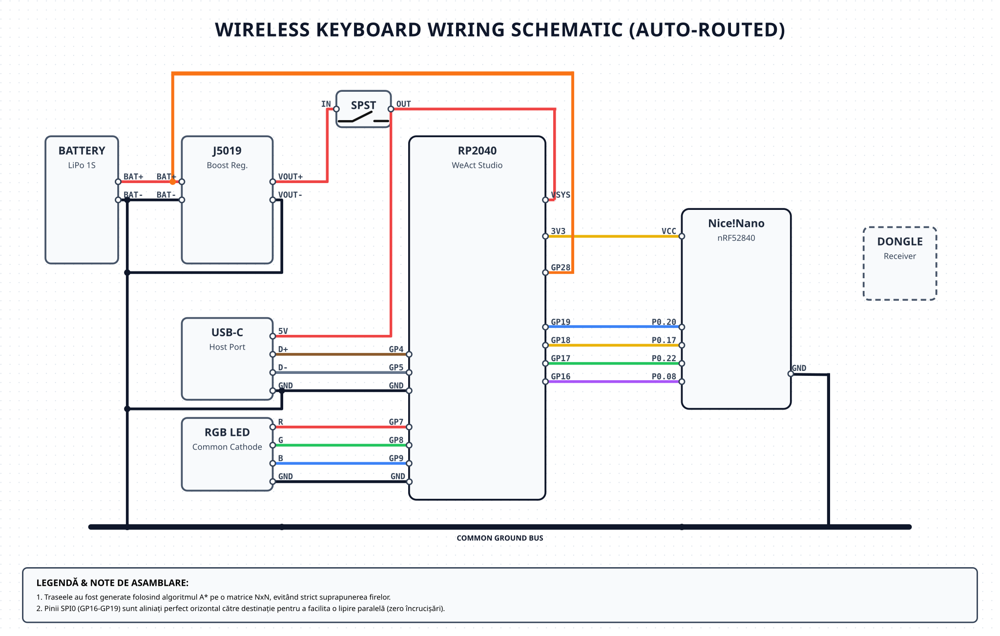
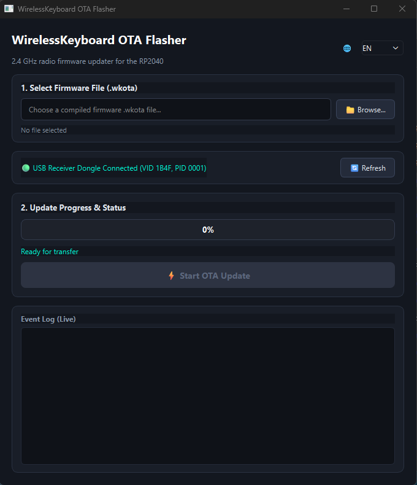

# RP2040 USB HID Host Controller & SPI Master

This firmware runs on the **Raspberry Pi Pico (RP2040)** inside the custom wireless keyboard build. It acts as the central brain of the keyboard: operating a 1000 Hz software USB HID host through PIO-USB, decoding physical keyboard matrices and media keys, handling battery ADC telemetry with dual-mode CC/CV charging detection and RGB PWM visual feedback, and forwarding input packets over an 8 MHz SPI master bus to the nRF52840 Transmitter.

---

## Ecosystem & Repositories (v1.0 Stable)

This firmware is part of the 3-tier custom wireless keyboard project:
- 🧠 **[RP2040 Keyboard Controller](https://github.com/Monard2033/RaspberryPicoUSBHost)** (this repository): USB Host, Battery ADC & 8 MHz SPI Master.
- 📻 **[nRF52840 Transmitter](https://github.com/Monard2033/nRF52840-Transmitter)**: Pro Micro SPI Slave & 2.4 GHz ESB PTX (+8 dBm).
- 📡 **[nRF52840 Receiver](https://github.com/Monard2033/nRF52840-Receiver)**: USB Dongle 2.4 GHz ESB PRX & 1000 Hz USB HID Bridge.

### Primary Release Artifacts
- **Firmware Binary**: [`firmware/WirelessKeyboard.uf2`](firmware/WirelessKeyboard.uf2)
- **SHA-256 Checksum**: `485D73F01EEF2493DD415A1E74643D9061B5E056CE2C43C2F221EA0D42DC605D`
- **Wireless OTA Package**: [`firmware/WirelessKeyboard_OTA.wkota`](firmware/WirelessKeyboard_OTA.wkota)

---

## Key Features & Architecture

1. **Software USB HID Host (PIO-USB @ 1000 Hz)**:
   - Utilizes RP2040 PIO state machines on Core 0 (`GP4` D+, `GP5` D-) to poll USB Full-Speed HID keyboards at 1000 Hz.
   - Decodes standard 6KRO (8-byte / 9-byte) reports and NKRO bitmap descriptors (10 to 64 bytes) with full ErrorRollOver containment.
   - Dedicated separate endpoints for Keyboard and Consumer Control to eliminate host-stall collisions during fast modifier bursts.
2. **Adaptive MISO-Based 8 MHz SPI Master (Link Protocol 0x03)**:
   - Dedicated 8 MHz SPI bus transmits 12-byte fixed link frames: `magic (0xA5)`, `version (0x03)`, `type (1 byte)`, `sequence (1 byte)`, `payload (8 bytes)`.
   - **Adaptive MISO-based Zero-Loss Protocol**: Detects the slave's reverse-ACK byte on MISO (`0x5A` = delivered, `0x00` = unacknowledged).
   - **Ultra-Fast Pacing**: `SPI_MIN_GUARD_US = 150u` allows up to $\approx 5000+\text{ fps}$ throughput ($5\times$ headroom over 1000 Hz USB), achieving $\approx 0.17\text{ ms}$ typical frame transport latency.
   - **Deterministic Fast Retries**: If EasyDMA is un-armed (`0x00`), triggers up to 8 prioritized fast retries with `SPI_RETRY_GUARD_US = 100u`, guaranteeing 100% deterministic zero-loss delivery.
3. **Calibrated Battery Telemetry & Dual-Mode CC/CV Detection**:
   - **High-Precision ADC Sampling**: Sampled at 1 Hz on `GP28` (ADC2) with 64x hardware oversampling and calibrated scale `#define BATT_ADC_SCALE_NUM 9831u` for exact 1:1 physical multimeter matching ($0.001\text{ V}$ accuracy).
   - **CC Phase Detection**: Detects constant-current charging slope ($\Delta V \ge +15\text{ mV}$) across a 16-sample rolling window.
   - **CV Phase Detection**: Detects constant-voltage top saturation ($\ge 4160\text{ mV}$) maintaining flat voltage for 16 consecutive seconds.
   - **Visual RGB LED Feedback**: Local 4-pin RGB LED on `GP21` (Red), `GP20` (Green), `GP19` (Blue) with hardware PWM for 8-second boot-up/event status indication.
4. **Intelligent Power Management & Sleep**:
   - After 5 minutes of idle time with all keys released, queues `LINK_CONTROL_SYSTEM_OFF` to place the transmitter into $0.5\ \mu A$ deep sleep, signaled by 4 blue LED pulses.
   - First physical keypress wakes the transmitter via active-low CSN pulse without losing the wake-up key stroke.
5. **Dual-Bank 4MB Wireless OTA DFU**:
   - Integrated dual-bank flash partition layout with 32-bit CRC32 verification and hardware target locks for over-the-air firmware updates via `tools/FLASH_OTA.exe`.

---

## Sonix routing validation and current test boundary

The descriptor-driven Sonix FS300 routing record, capture evidence, and release
artifact locations are maintained in
[`docs/SONIX_DIAGNOSTIC.md`](docs/SONIX_DIAGNOSTIC.md). The 2026-10-08 hardware
run validated immediate NumLock LED response, normal typing, and simultaneous
multi-key input through the previously failing rollover case with payload size
77,416 bytes and CRC32 `0xE929F70F`. The physical application report is true
full NKRO within the captured 21-byte report, while the established 8-byte SPI
link still exposes six ordinary key slots downstream.

### 1. Sonix rollover symptom and verified cause

The earlier symptom looked like a keyboard freeze after the LED state changed:
four or more simultaneous keys stopped arriving while Consumer Control volume
events continued and the device did not re-enumerate. The diagnostic capture
showed normal NAK activity on boot EP `0x81`; the actual keyboard reports had
moved to application EP `0x83`, Report ID `1`, and the old instance filter
ignored them. Consumer Control remained Report ID `3`.

There is no evidence that EP0 `SET_REPORT` corrupts the Sonix silicon, and the
capture does not establish a silicon failure mechanism. The fix parses the HID
descriptor for every instance, routes the application keyboard bitmap by its
declared Report ID and bit offsets, and preserves global latest-valid state with
delivery deduplication across the BOOT-to-application handoff. LED output stays
on the BOOT target and is synchronized through the validated path.

The Sonix MCU lights NumLock by itself at power-up, so the baseline remains a useful rollback
reference. Direct hardware testing confirms that the validated build also updates the NumLock
LED immediately during normal operation. The earlier Gemini explanation that EP0
`SET_REPORT` corrupts the silicon or that LED synchronization must remain disabled
is obsolete and is not part of the current diagnosis.

**Status:** the production candidate is hardware-validated for immediate NumLock LED response,
normal typing, and multi-key rollover. The BOOT-to-application transition is routed by parsed
descriptors across all HID instances: keyboard Report ID 1 arrives on EP `0x83`, while Consumer
Report ID 3 remains independent. Global latest-valid state and delivery deduplication preserve
release handoff across the BOOT and application interfaces.

The RP2040 radio bridge still normalizes the physical keyboard stream to the existing
8-byte boot report, so the end-to-end transport exposes at most six ordinary key slots.
That transport limit is separate from the physical full-NKRO report.

### 2. Look-alike freeze: nRF SPI slave not arming MISO has no recovery either

If the nRF52840 SPI slave stops arming MISO while the RP2040 is in `RADIO_AWAKE`,
`spi_write_frame()` sees `slave_armed == false` for every frame, each frame burns its 8 retries
and is dropped forever - keys never transmit again until a power cycle. **Distinguish it from
rule 1:** with a dead SPI/ESB link the Consumer/media keys are dead too, and there is no nRF
sleep blink. There is no SPI re-init / link watchdog in the firmware yet; only
`spi_frames_lost` / `spi_miso_retries` record it.

---

## Active Hardware Pinout & Wiring

<p align="center">
  
</p>

### 1. USB Keyboard Matrix / Converter to RP2040

| USB Side | RP2040 Pin | Function / Description |
| :---: | :---: | :--- |
| **`D+`** | **`GP4`** | PIO-USB Software Host D+ |
| **`D-`** | **`GP5`** | PIO-USB Software Host D- |
| **`GND`** | **`GND`** | Common Ground Reference |

### 2. RP2040 Master to nRF52840 Transmitter

| RP2040 Pin | nRF52840 ProMicro Pin | Signal Name | Description |
| :---: | :---: | :---: | :--- |
| **`GP16`** | **`P0.08`** | **`SPI SCK`** | 8 MHz SPI Clock from RP2040 |
| **`GP17`** | **`P0.22`** | **`SPI MOSI`** | Serial Data from RP2040 to Transmitter |
| **`GP18`** | **`P0.17`** | **`SPI MISO`** | Reverse ACK / LED Status from Transmitter |
| **`GP19`** | **`P0.20`** | **`SPI CSN`** | Active-Low Chip Select & Hardware Wake Sense |
| **`3V3 (OUT)`** | **`VCC / 3V3`** | **`3.3V Power`** | Regulated 3.3V power rail for nRF52840 |
| **`GND`** | **`GND`** | **`Ground`** | Common Ground Reference |

> [!CAUTION]
> Never connect 5V VBUS/VSYS to the direct 3.3V/VCC pin of the nRF52840 module. Keep all ground connections common.

### 3. Battery Voltage Divider & RGB Status LED

| Component | RP2040 Pin | Configuration & Notes |
| :---: | :---: | :--- |
| **RGB Red** | **`GP7`** | PWM Red Channel (through 220–330 Ω resistor) |
| **RGB Green** | **`GP8`** | PWM Green Channel (through 220–330 Ω resistor) |
| **RGB Blue** | **`GP9`** | PWM Blue Channel (through 220–330 Ω resistor) |
| **RGB Common** | **`GND`** | Default Common-Cathode configuration (`LED_COMMON_ANODE=0`) |
| **Battery (+) Tap** | **`GP28 / ADC2`** | Voltage divider: 200 kΩ to Vbat (+), 100 kΩ to GND ($V_{meas} = V_{batt} / 3$) |
| **Battery (-)** | **`GND`** | Li-Ion Cell Ground Reference |

---

## Flashing & Programming Guide

### Flashing via BOOTSEL (USB Cable):

1. Hold down the **`BOOTSEL`** button on the RP2040 board and connect it to your PC (or press reset while holding BOOTSEL).
2. A mass storage drive named **`RPI-RP2`** will appear in Windows Explorer.
3. Drag and drop [`firmware/WirelessKeyboard.uf2`](firmware/WirelessKeyboard.uf2) onto the drive.
4. The RP2040 will flash immediately and reboot into wireless keyboard mode.

### Wireless OTA Flashing (GUI — recommended):

Run the graphical flasher (`tools/FLASH_OTA.exe`, or rebuild it with `tools/build_ota_flasher.ps1`). It detects the Receiver Dongle automatically, lets you pick the firmware package, streams it over the 2.4 GHz radio with per-chunk sequence protection (idempotent recovery), verifies the staging CRC before activation, and shows the live event log:



UI is available in EN/RU/RO (default EN). The command-line variant does the same thing without a window:

```powershell
# GUI (recommended)
.\tools\FLASH_OTA.exe

# CLI
.\tools\flash_ota_cmd.exe firmware\WirelessKeyboard_OTA.wkota
```

Notes:
- Use ONLY `tools\FLASH_OTA.exe` (GUI, i18n EN/RU/RO) or `tools\flash_ota_cmd.exe`. The old root-level `Flash_Ota.exe` was a protocol **v1** build with a Romanian-only UI; flashing with it against current firmware aborts after 2 s per page with `[RESEND] no ACK progress` / `EROARE: Timeout la confirmarea paginii la offset-ul 256`. It has been deleted from the repository. If you see Romanian-only status lines, you are running v1 - stop and use the tools\ binaries.
- The transfer runs at the stable ~2 KB/s ESB ACK-payload throughput (~35 s for a 74 KB image); typing on the keyboard during the transfer is tolerated — duplicated/out-of-order chunks are dropped device-side by the chunk-sequence protocol.
- After the swap the RP2040 reboots into the new firmware and reports `BOOT_OK` over the radio; no BOOTSEL cable access is needed for routine updates.
- A last-known-good package is kept at `firmware/WirelessKeyboard_OTA_WORKING_BACKUP.wkota` — flashing it over the air instantly reverts to the validated working state.

### Wireless OTA Flashing (legacy CLI):

The original streaming CLI remains available for scripted updates:

```powershell
& "$env:USERPROFILE\.pico-sdk\python\3.13.7\python.exe" tools\flash_ota.py firmware\WirelessKeyboard_OTA.wkota
```

---

## Critical Timing & Parameter Boundary Specifications

| Parameter | Value / Constraint | Architectural Rationale |
| :--- | :---: | :--- |
| **`SPI Min Guard & Retry`** | **`150 µs` / `100 µs`** (`SPI_MIN_GUARD_US` / `SPI_RETRY_GUARD_US`) | Adaptive MISO-based SPI transport: detects reverse-ACK byte `0x5A` immediately. If un-armed (`0x00`), automatically retries up to 8 times with a 100 µs guard, achieving $\approx 0.17\text{ ms}$ transport latency with 100% deterministic zero-loss delivery. |
| **`SPI CSN Setup Time`** | **`2 µs`** (`sleep_us(2)`) | Ensures stable CSN falling edge before master clock and valid hold time before rising edge. |
| **`System Clock`** | **`96 MHz`** (or `120 MHz`) | Minimum clock required for PIO-USB 96 MHz receive sampler. |
| **`Battery ADC Scale`** | **`9831u`** (`BATT_ADC_SCALE_NUM`) | Hardware-calibrated multiplier matching physical cell voltage 1:1 down to $0.001\text{ V}$. |
| **`Battery Telemetry Period`** | **`20000 ms`** (20s) | Periodic telemetry update interval during keyboard activity without interrupting urgent input. |

---

## Windows Battery Monitoring App (`WirelessKeyboardTray`)

A dedicated lightweight Windows utility is available in [`tools/WirelessKeyboardTray/dist/`](tools/WirelessKeyboardTray/dist/):

- **Executable**: [`tools/WirelessKeyboardTray/dist/WirelessKeyboardTray.exe`](tools/WirelessKeyboardTray/dist/WirelessKeyboardTray.exe)
- **Archive package**: [`tools/WirelessKeyboardTray/dist/WirelessKeyboardTray.zip`](tools/WirelessKeyboardTray/dist/WirelessKeyboardTray.zip)

### Features & Capabilities:
- 🔋 **Live Real-Time Telemetry**: Queries the Receiver's Vendor Feature Interface to display battery percentage and cell voltage with $0.001\text{ V}$ multimeter accuracy.
- ⚡ **Charging & Power State Display**: Real-time status indicator for *Discharging*, *Charging (CC/CV)*, and *Full*.
- 🕒 **Telemetry Age & Liveness**: Monitors telemetry freshness with an instant manual *Refresh now* action.
- 🖥️ **System Tray Integration**: Native Windows notification area icon, low-battery alert popups, and *Start with Windows* autostart support.

